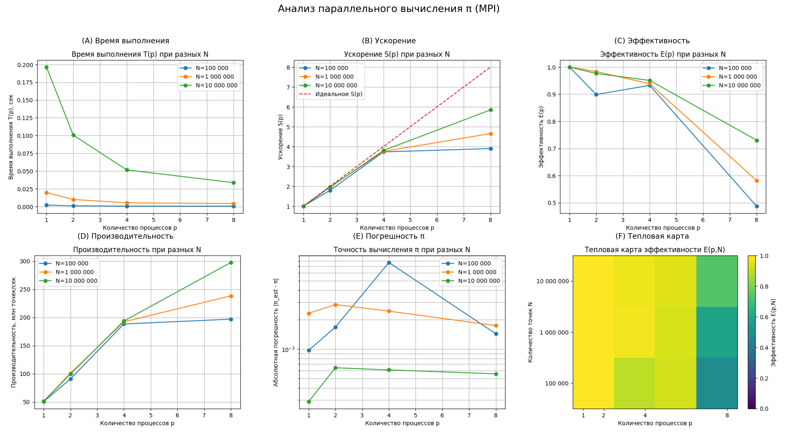

# Лабораторная 1 — MPI

Результаты и графики лежат в папке `lab1/task_1/`.

## Задание 1. Вычисление числа π

На каждом процессе независимо генерировались случайные точки внутри квадрата `[-1; 1] x [-1; 1]`.  
Процесс считал, сколько точек попало в единичную окружность.  

## Сводный график для задания 1

Выводы

При большом числе точек (N = 10 000 000) распараллеливание даёт существенный выигрыш:
время на 1 процессе ≈ 0.196 с, на 8 процессах ≈ 0.034 с (ускорение примерно в 6 раз).

Эффективность высока (порядка 0.9-1.0) для 2-4 процессов и снижается до ~0.7 при 8 процессах
из-за накладных расходов MPI, но даже при этом программа остаётся быстрее последовательной.

Для маленьких задач (N = 100 000) прирост по времени меньше - накладные расходы становятся заметнее.

Точность оценки π в первую очередь растёт с увеличением количества точек и почти не зависит
от числа процессов: параллелизация влияет на скорость, но не ухудшает качество результата.

Работа (код, замеры, построение графиков и анализ) выполнялась совместно нашей группой.

Код для задания 1: lab1/task_1/task1.c.

